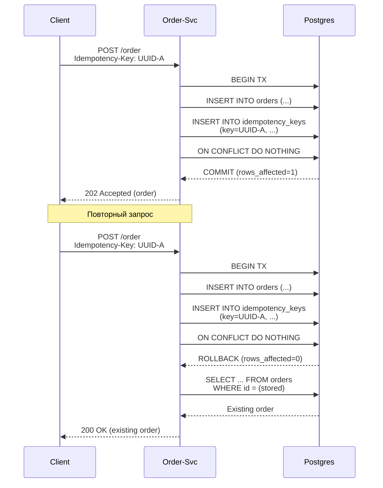

# Идемпотентность API — Order Service. Homework 9

**Паттерн:** Client-Supplied Idempotency Key (ключ идемпотентности, предоставляемый клиентом)

Клиент передаёт UUID в заголовке `Idempotency-Key`. Первый запрос → **202**, повторный → **200** с тем же заказом.

## Диаграмма последовательности



## Состав

| Сервис | Образ |
|--------|-------|
| auth-service | `mblkuta/auth-service:latest` |
| profile-service | `mblkuta/profile-service:0.3.0` |
| billing-service | `mblkuta/billingsvc:0.3.1` |
| **order-service** | **`mblkuta/ordersvc:hw9-v2`** (идемпотентный!) |
| notification-service | `mblkuta/notificationsvc:0.3.0` |
| warehouse-service | `mblkuta/warehousesvc:0.1.0` |
| delivery-service | `mblkuta/deliverysvc:0.1.0` |
| rabbitmq | `rabbitmq:3.13-management-alpine` |
| postgres (7 шт) | `postgres:16-alpine` |
| traefik | Ingress |

## Установка

```bash
cd idempotency
helm install arch-homework ./helm --namespace arch-homework --create-namespace --wait --timeout 10m
kubectl get pods -n arch-homework
```

## Postman

Коллекция: `./idempotency-tests.postman_collection.json`
`{{baseUrl}} = http://arch.homework`

## Прогон тестов через Newman

```bash
# Установка Newman
npm install -g newman

newman run ./idempotency-tests.postman_collection.json \
  --env-var "baseUrl=http://arch.homework" \
  --reporters cli
```